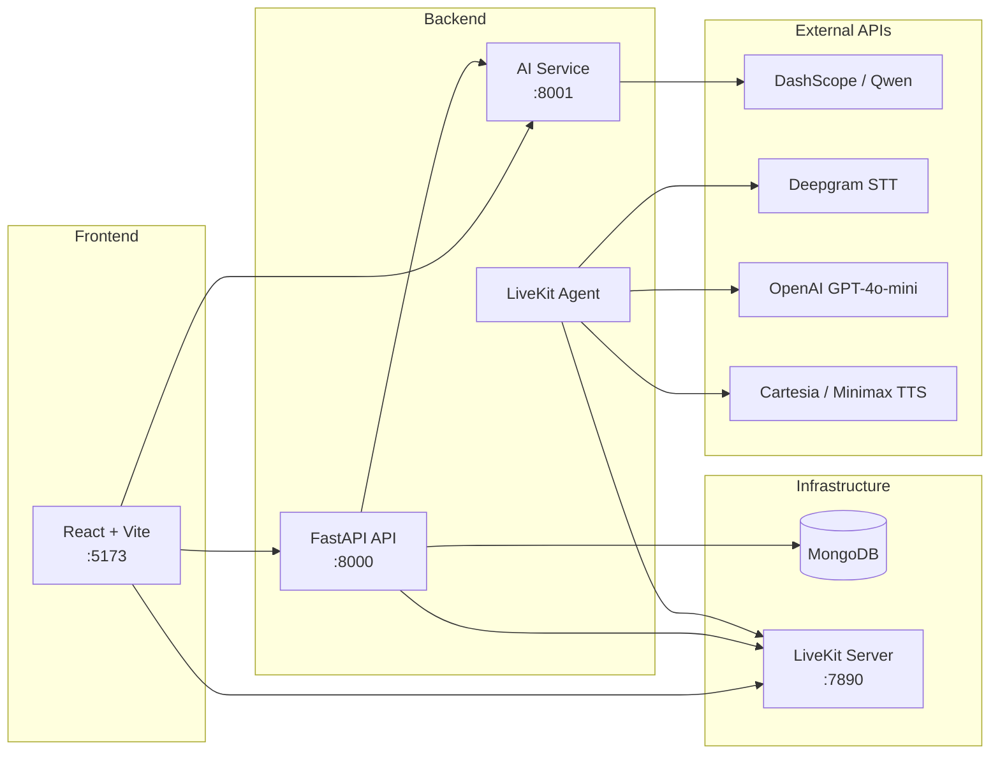

<<<<<<< HEAD
# Language App
=======
# Speak Up AI
>>>>>>> a9ba29e (ready for public)

**An AI-powered personal language learning platform.** Practice a target language (currently English) with explanations and glosses in your native language.

From spaced-repetition flashcards to live voice conversation, all practice modules live in a single interface. Text AI (Qwen) and voice AI (LiveKit) work together; your progress is stored in MongoDB.

---

## Features

| Module | Description |
|--------|-------------|
| **Dashboard** | Daily goals, streaks, accuracy stats, and quick-access cards |
| **Vocabulary** | SM-2 spaced repetition (SRS) flashcard system |
| **Sentence Practice** | Build sentences from vocabulary cards (`/vocab/practice`) |
| **Substitution Drill** | Swap words in pattern sentences (`/vocab/drill`) |
| **Reader** | Read texts with instant word-level translation on hover |
| **Speak & Translate** | Read a prompt in your native language, speak it in the target language |
| **Scenarios** | Context-based role-play practice |
| **Chat** | Free-form conversation with a LangChain AI tutor |
| **Live Voice** | Real-time spoken practice in the target language via LiveKit |
| **Settings** | Native language, daily goals, and preferences |

### Temporarily disabled

These routes still exist but show a “coming soon” screen while algorithms and content are being reworked (`apps/web/src/lib/disabledFeatures.ts`):

| Module | Route |
|--------|-------|
| Top 100 Words | `/top-words` |
| Journal | `/journal` |
| Tenses | `/tenses` |
| Lyrics | `/lyrics` |

---

## Languages

Set your **native language** in Settings. Vocabulary glosses, Speak & Translate prompts, and other native-language help follow that choice. The **target language** is currently English.

| Code | Native language |
|------|-----------------|
| `tr` | Türkçe |
| `en` | English |
| `de` | Deutsch |
| `es` | Español |
| `fr` | Français |
| `ar` | العربية |
| `ru` | Русский |
| `zh` | 中文 |
| `ja` | 日本語 |
| `ko` | 한국어 |
| `pt` | Português |
| `it` | Italiano |
| `nl` | Nederlands |
| `pl` | Polski |
| `uk` | Українська |

The list lives in `apps/web/src/lib/languages.ts`.

---

## Architecture



| Layer | Technology |
|-------|------------|
| Frontend | React 19, Vite, React Router, TanStack Query, Tailwind CSS, shadcn/ui |
| API | FastAPI, Beanie (MongoDB ODM) |
| Text AI | LangChain + Alibaba DashScope `qwen3.5-flash` |
| Live Voice | LiveKit Agents, Deepgram STT, GPT-4o-mini, Cartesia / Minimax TTS |
| Database | MongoDB |

---

## Requirements

- **Node.js** 18+
- **Python** 3.11+
- **MongoDB** (local or remote)
- **Docker** — only for the live voice module (LiveKit server)

---

## Quick Start

### 1. Clone the repository

```bash
git clone https://github.com/YOUR_USER/dil-programi.git
cd dil-programi
```

### 2. Configure environment variables

```bash
cp .env.example .env
```

Edit `.env` and fill in the required API keys. See [Environment Variables](#environment-variables) for details.

> **Security:** Never commit `.env` to Git. Keep real API keys in your local `.env` file only.

### 3. Python virtual environments

Create a separate virtual environment for each service:

```bash
# API
cd services/api
python3 -m venv .venv && source .venv/bin/activate
pip install -r requirements.txt
deactivate

# AI
cd ../ai
python3 -m venv .venv && source .venv/bin/activate
pip install -r requirements.txt
deactivate

# Voice (optional — for live conversation)
cd ../voice
python3 -m venv .venv && source .venv/bin/activate
pip install -r requirements.txt
deactivate
```

### 4. Seed the database

```bash
cd services/api
source .venv/bin/activate
PYTHONPATH=. python scripts/seed.py
deactivate
```

### 5. Frontend

```bash
cd apps/web
npm install
```

### 6. Run

**Single command** (API + AI + Web together):

```bash
./scripts/dev.sh
# or
./scripts/dev.sh all
```

**Run services individually:**

```bash
./scripts/dev.sh api    # http://localhost:8000/docs
./scripts/dev.sh ai     # http://localhost:8001/docs
./scripts/dev.sh web    # http://localhost:5173
./scripts/dev.sh voice  # LiveKit agent
./scripts/dev.sh seed   # Re-seed the database
```

| Service | URL |
|---------|-----|
| Web UI | http://localhost:5173 |
| API (Swagger) | http://localhost:8000/docs |
| AI service | http://localhost:8001/docs |
| LiveKit | ws://127.0.0.1:7890 |

---

## Live Voice (LiveKit)

Start the LiveKit server with Docker:

```bash
cd docker
docker compose up -d
```

Then run the voice agent:

```bash
./scripts/dev.sh voice
```

For local development, LiveKit credentials default to `devkey` / `secret` (matching `docker/livekit.yaml` and `.env.example`).

Live voice additionally requires:

- `OPENAI_API_KEY` — conversation logic (GPT-4o-mini)
- `DEEPGRAM_API_KEY` — speech-to-text (STT)
- `CARTESIA_API_KEY` or `MINIMAX_API_KEY` — text-to-speech (TTS)

---

## Environment Variables

The root `.env` file is read by all services.

| Variable | Required | Description |
|----------|----------|-------------|
| `MONGODB_URL` | Yes | MongoDB connection string |
| `DASHSCOPE_API_KEY` | For text AI | [Alibaba DashScope](https://www.alibabacloud.com/product/modelstudio) API key |
| `DASHSCOPE_API_BASE` | No | Default: international compatible endpoint |
| `QWEN_MODEL` | No | Default: `qwen3.5-flash` |
| `OPENAI_API_KEY` | For voice | Live conversation LLM |
| `DEEPGRAM_API_KEY` | For voice | Speech-to-text |
| `TTS_PROVIDER` | No | `cartesia` or `minimax` |
| `CARTESIA_API_KEY` | For TTS | Cartesia speech synthesis |
| `MINIMAX_API_KEY` | For TTS | Minimax speech synthesis (alternative) |
| `GROQ_API_KEY` | No | Optional fast LLM |
| `LIVEKIT_URL` | For voice | WebSocket URL |
| `LIVEKIT_API_KEY` | For voice | Local dev: `devkey` |
| `LIVEKIT_API_SECRET` | For voice | Local dev: `secret` |
| `VITE_API_URL` | Yes | Frontend → API (`http://localhost:8000`) |
| `VITE_AI_URL` | Yes | Frontend → AI (`http://localhost:8001`) |
| `VITE_LIVEKIT_URL` | For voice | Frontend → LiveKit |

See `.env.example` for the full template.

---

## Project Structure

```
dil-programi/
├── apps/web/              # React frontend
├── services/
│   ├── api/               # FastAPI — CRUD, SRS, chat proxy, LiveKit tokens
│   ├── ai/                # LangChain — word, text, and exercise generation
│   └── voice/             # LiveKit agent — real-time voice practice
├── docker/
│   ├── docker-compose.yml # LiveKit server
│   └── livekit.yaml       # Local LiveKit config
├── scripts/
│   └── dev.sh             # Development launcher
├── .env.example           # Environment variable template
└── README.md
```

---

## Which Module Needs Which Service?

| Module | API | AI | Voice |
|--------|:---:|:--:|:-----:|
| Vocabulary, Reader | ✓ | ✓ | |
| Chat, Scenarios | ✓ | ✓ | |
| Speak & Translate | ✓ | ✓ | |
| Live Voice | ✓ | | ✓ |

Text-based modules only need the **API + AI** services. Live voice also requires **LiveKit + the voice agent**.

---

## Development Notes

- Seed data includes the Oxford 3000 word list, tense explanations, scenarios, and reading passages.
- The API service proxies to the AI service over HTTP; the frontend can also connect to AI directly.
- Single-user local development uses the default `default_user_id=local_user`.
- Frontend production build: `cd apps/web && npm run build`

---

## Contributing

1. Fork the repo and create a feature branch (`git checkout -b feature/my-feature`)
2. Commit your changes
3. Push your branch and open a Pull Request

Never commit API keys, `.env` files, or personal data.

---

## License

This project will be released as open source. This section will be updated once a license file is added.
